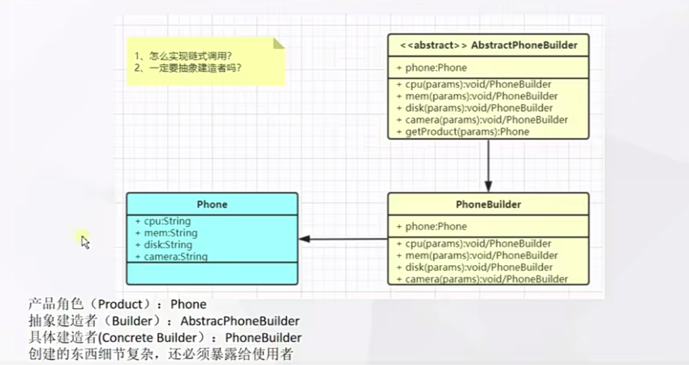

# 什么是建造者模式



## 代码

```java

public abstract class AbstractBuilder {
    Phone phone;

    abstract AbstractBuilder customComCpu(String cpu);

    abstract AbstractBuilder customComMem(String mem);

    abstract AbstractBuilder customComDisk(String disk);

    abstract AbstractBuilder customComCam(String cam);

     Phone getProduct(){
        return phone;
    }
}
```

```java

public class Phone {
    private String cpu;
    private String men;
    private String disk;
    private String cam;


    public String getCpu() {
        return cpu;
    }

    public void setCpu(String cpu) {
        this.cpu = cpu;
    }

    public String getMen() {
        return men;
    }

    public void setMen(String men) {
        this.men = men;
    }

    public String getDisk() {
        return disk;
    }

    public void setDisk(String disk) {
        this.disk = disk;
    }

    public String getCam() {
        return cam;
    }

    public void setCam(String cam) {
        this.cam = cam;
    }

    @Override
    public String toString() {
        return "Phone{" +
                "cpu='" + cpu + '\'' +
                ", men='" + men + '\'' +
                ", disk='" + disk + '\'' +
                ", cam='" + cam + '\'' +
                '}';
    }
}

```

```java

public class XiaoMiBuilder extends AbstractBuilder {

    public XiaoMiBuilder() {
        phone = new Phone();
    }

    @Override
    AbstractBuilder customComCpu(String cpu) {
        phone.setCpu(cpu);
        return this;
    }

    @Override
    AbstractBuilder customComMem(String mem) {
        phone.setMen(mem);
        return this;
    }

    @Override
    AbstractBuilder customComDisk(String disk) {
        phone.setDisk(disk);
        return this;
    }

    @Override
    AbstractBuilder customComCam(String cam) {
        phone.setCam(cam);
        return this;
    }


}

```

# 使用场景

- `StringBuilder`
- `Swagger-ApiBuilder`
- 快速实现。`Lombok-Builder`模式