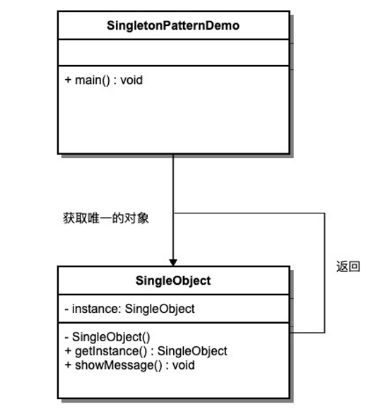

## 什么是单列模式?

1. 一个单一的类,负责创建自己的对象,同时确保系统中只有单个对象呗创建.
2. 特点:
      -  某个类只能有一个实例
      - 他必须自行创建这个实例
      - 他必须自行向整个系统提供这个方法




## 什么场景用到？

- 多线程中的线程池
- 数据库的连接池
- 系统环境信息
- 上下文（`ServletContext`）

## 代码

```java
package com.example.studydemo;

import lombok.Data;

/**
 * @Author hgl
 * @Date 2022/3/6 18:04
 * @Description
 */
@Data
public class Singleton {
    private String name;
    private String age;
    /**
     * 饿汉式
     *     private final static Singleton singleton = new Singleton();
     */
    /**
     * 懒汉式
     */
    private volatile static Singleton singleton;


    /**
     * 构造器私有,外部不能实例化
     */
    private Singleton() {
        System.out.println("Singleton创建了...");
    }

    /**
     * 提供给外部的方法
     *
     * @return Singleton
     * @description 不加锁的情况下会导致线程安全问题 例如: 8个线程同时抢占,会有8个实例创建?
     * public static synchronized Singleton getInstance 锁太大,效率低
     * synchronized  类级别的锁  每次只能进一个
     */

    public static synchronized Singleton getInstance() {
        // 懒汉式  双重校验+内存可见性  效率最好
        if (singleton == null) {
            synchronized (Singleton.class) {
                if(singleton == null){
                    // 先创建对象 在分配地址  内存屏障问题
                    Singleton singleton = new Singleton();
                    Singleton.singleton = singleton;
                }
            }
        }
        return singleton;

        // <=============================>
        // 饿汉式
//        return singleton;
    }


}

```


面试问题

- 系统环境信息（`System.getProperties()`）？
- Spring中怎么保持组件单例的？
- `ServletContext`是什么（封装`Servlet`的信息）？是单例吗？怎么保证？
- `ApplicationContext`是什么？是单例吗？怎么保证？
- `ApplicationContext`： tomcat：一个应用（部署的一个war包）会有一个应用上下文
- `ApplicationContext`： Spring：表示整个`IOC容`器（怎么保证单例的）。`ioc`容器中有很多组件（怎么保证单例）
- 数据库连接池一般怎么创建出来的，怎么保证单实例？

