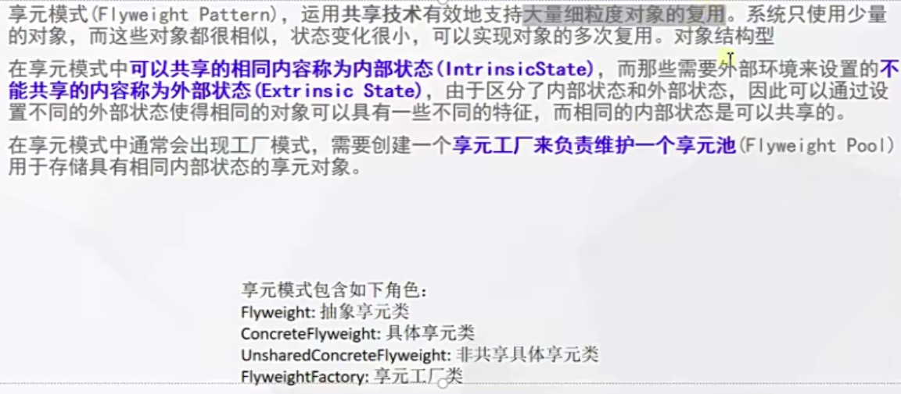

# 什么是享元模式




## 代码

```java


public abstract class AbstractWaitressFlyweight {
    /**
     * 正在服务  享元的不可共享属性留给外部进行改变的接口
     */
    abstract void service();

    /**
     * 服务完成  享元的不可共享属性留给外部进行改变的接口
     */
    abstract void end();

   private boolean canService = true;

    boolean isCanService(){
        return canService;
    };

}
```

```java
public class BeautifulWaitress extends AbstractWaitressFlyweight {

    String id;

    String name;

    public BeautifulWaitress(String id, String name, int age, boolean canService) {
        this.id = id;
        this.name = name;
        this.age = age;
        this.canService = canService;
    }

    int age;

    boolean canService = true;

    @Override
    void service() {
        System.out.println(id + name + age + "正在服务");
        this.canService = false;
    }

    @Override
    void end() {
        System.out.println(id + name + age + "结束");
        this.canService = true;
    }
}
```

```java
public class ZuDao {

    private static Map<String, AbstractWaitressFlyweight> poolMap = new HashMap();
    // 享元,池子中有对象

    static{
        BeautifulWaitress beautifulWaitress = new BeautifulWaitress("11","fdg",15,true);
        BeautifulWaitress beautifulWaitress2 = new BeautifulWaitress("22","cs",15,true);
        poolMap.put(beautifulWaitress.id,beautifulWaitress);
        poolMap.put(beautifulWaitress2.id,beautifulWaitress2);
    }

    public void addWaitressFlyweight(AbstractWaitressFlyweight flyweight){
        poolMap.put(UUID.randomUUID().toString(),flyweight);
    }

    public static AbstractWaitressFlyweight getInstance(String name){
        AbstractWaitressFlyweight abstractWaitressFlyweight = poolMap.get(name);
        if (abstractWaitressFlyweight == null){
            for (AbstractWaitressFlyweight value : poolMap.values()) {
                if (value.isCanService()){
                    return value;
                }
            }
            return null;

        }
        return abstractWaitressFlyweight;

    }
}
```

# 使用场景

- 典型的代表：数据库连接池

- 所有的池化技术

- 享元和原型模式有什么区别？享元是预先准备好的对象进行复用，原型没法确定预先有哪些