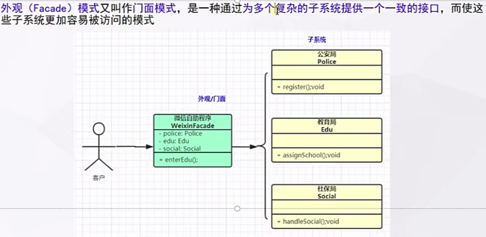

# 什么是外观模式



## 代码

```java
public class Edu {
    public void assignSchool(String school){
        System.out.println(school +"分配成功");
    }
}
```

```java
public class Police {


    public void resgister(String name) {
        System.out.println(name + "已办理落户");
    }

}
```

```java
public class Social {
    public void handleSocial(String name) {
        System.out.println(name + "已办理落户");
    }
}
```

```java
public class WeiXinFacade {


    public void handle(String name) {
        Police police = new Police();
        police.resgister(name);
        Social social = new Social();
        social.handleSocial(name);
        Edu edu = new Edu();
        edu.assignSchool(name);

    }
}
```

# 使用场景

- 去医院看病，可能要挂号、门诊、划价、取药、让患者家属觉得很复杂，如果有提供接待人员，只让接待人员来处理，就很方便
- Java 的三层开发模式
- 分布式系统的网关
- `Tomcat`源码中的`RequestFacade` 干什么的