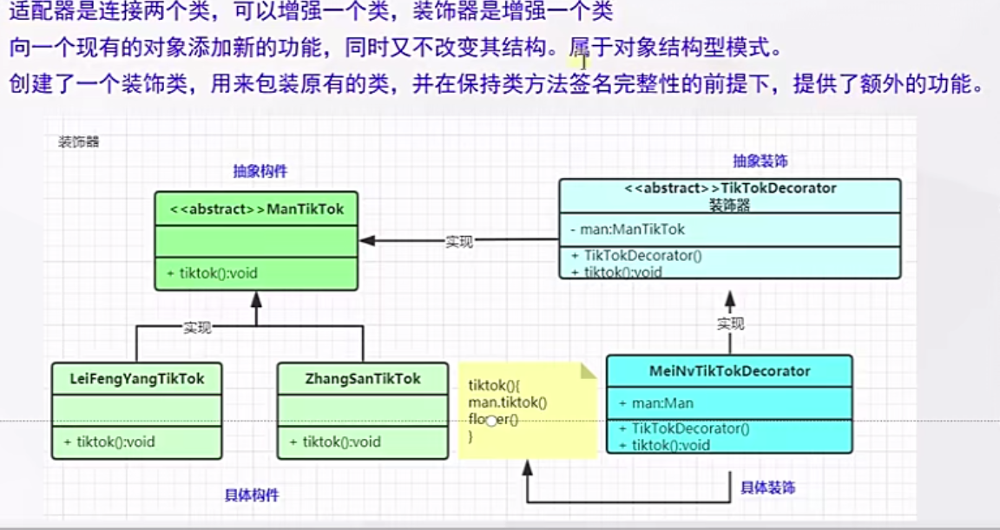

# 什么是适配器模式



## 代码

```java
public interface  ManTikTok {

    void tiktok();

}
```

```java
public class MeiYanDecorator implements TikTokDecorator {


    private ManTikTok meiYanTok;

    public MeiYanDecorator(ManTikTok meiYanTok) {
        this.meiYanTok = meiYanTok;
    }
    @Override
    public void tiktok() {
        // 开启美颜
      enable();
      meiYanTok.tiktok();
    }

    @Override
    public void enable() {
        System.out.println("看美女....");
    }
}
```

```java
public interface TikTokDecorator extends ManTikTok {

    /**
     * 开启美颜效果
     */
    void enable();
}
```

```java
public class LeiTikTok implements ManTikTok{
    @Override
    public void tiktok() {
        System.out.println("类.....,TikTok直播中");
    }
}
```

# 使用场景

- `SpringSession`中如何进行`session` 与`Redis`关联? `HttpRequestWrapper`

  - session : 数据存在了内存

  - session : 数据存在了`redis`

  - `httpSession `:  `getAttribute()`;如果不行 就可以重写 Wrapper()

  - Wrapper(session){

    ​    `getAttribute`(String `param`)  `redis.get(param)`

     }

- `MybatisPlus` 提取了`QueryWrapper`,这是什么?

- `Spring`中的`BeanWrapper` 是做什么?

- `Spring Webflux`中的`WebHandlerDecorator`? 

- 已存在的类,在某一天发现功能使用的时候不够,就可以装饰器