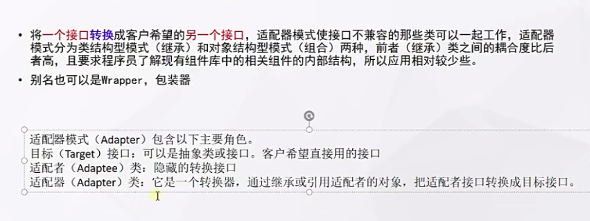

# 适配器模式




## 代码

```java
public class JPMovieAdapter implements  Player{

    private Player  target;

    public JPMovieAdapter(Player player){
        this.target = player;
    }

    @Override
    public String play() {
        String play = this.target.play();
        return "字幕";
    }
}
```

```java
public class MoviePlayer implements Player{


    @Override
    public String play() {
        return "真在播放.......";
    }
}
```

```java
public interface  Player {
    /**
     * 播放电影
     * @return String
     */
    String play();

}
```

# 使用场景

- `Tomcat` 如何将Request流转为标准Request;Request接口；
  - `tomcat.Requet`接口
  - `servlet.Request`接口  
  - `tomcat` === `CoyoteAdapte` === `ServletRequest`
- `Spring Aop`中的`AdvisorAdapter`是什么:   增强的适配器  
  - 前置、后置、结束  Advisor(通知方法)
  - 底层真的目标方法
- `Spring Mvc`中经典的`HandlerAdapter`是什么
  - Controller   底层调用`Servlet`
  - `HandlerAdapter`
  - `Servlet.doGet()`
- `SpringBoot`中`WebMvcConfigurerAdapter`为什么存在又取消