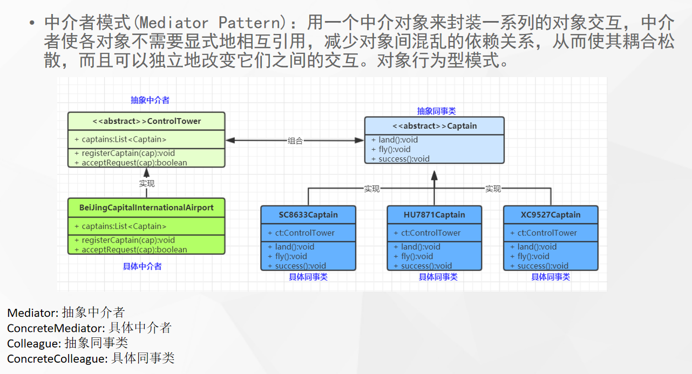

# 什么是中介模式



## 代码

```java
public abstract class Captain {

    //起飞
    abstract void fly();
    // 降落
    abstract void land();
    // 完成
    abstract void finish();
}
```

```java
public class ControlTower {

    private boolean canDo = true;

    public void acceptRequest(Captain captain, String action) {
        if ("fly".equals(action) || "down".equals(action)) {
            if (canDo) {
                System.out.println("允许起飞");
                canDo =false;
            } else {
                System.out.println("拒绝起飞...");
            }
        }else {
            canDo =true;
        }

    }
}
```

```java
public class HU8778 extends Captain {
    ControlTower controlTower;


    public HU8778(ControlTower controlTower) {
        this.controlTower = controlTower;
    }

    @Override
    void fly() {
        System.out.println("请求起飞...");
        controlTower.acceptRequest(this,"fly");
    }

    @Override
    void land() {
        System.out.println("请求降落...");
        controlTower.acceptRequest(this,"down");
    }

    @Override
    void finish() {
        System.out.println("完成...");
        controlTower.acceptRequest(this,"finish");
    }
}
```

```java
public class Sc8633 extends Captain{
    ControlTower controlTower = new ControlTower();


    public Sc8633(ControlTower controlTower) {
        this.controlTower = controlTower;
    }
    @Override
    void fly() {
        System.out.println("请求起飞...");
        controlTower.acceptRequest(this,"fly");
    }

    @Override
    void land() {
        System.out.println("请求降落...");
        controlTower.acceptRequest(this,"down");
    }

    @Override
    void finish() {
        System.out.println("完成...");
        controlTower.acceptRequest(this,"finish");
    }
}
```

```java
public class Xc9527 extends Captain{
    ControlTower controlTower;


    public Xc9527(ControlTower controlTower) {
        this.controlTower = controlTower;
    }
    @Override
    void fly() {
        System.out.println("请求起飞...");
        controlTower.acceptRequest(this,"fly");
    }

    @Override
    void land() {
        System.out.println("请求降落...");
        controlTower.acceptRequest(this,"down");
    }

    @Override
    void finish() {
        System.out.println("完成...");
        controlTower.acceptRequest(this,"finish");
    }
}
```

# 使用场景

- `SpringMVC` 的`DispatcherServlet`是一个中介者，他会提取Controller、Model、View来进行调用。而无需controller直接调用view之类的渲染方法
- 分布式系统中的网关
- 迪米特法则的一个典型应用
- 中介者和外观（门面）模式区别？
  - 中介者双向操作，门面偏向于封装某一方