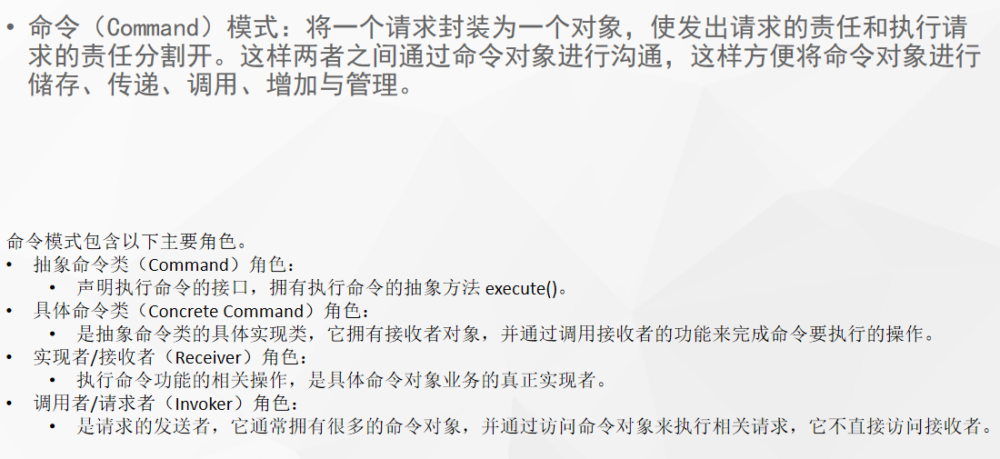

# 什么是命令模式



## 代码

```java
public class WuHanTravelCommand implements Command {

    private LeiReceivier leiReceivier = new LeiReceivier();
    @Override
    public void execute() {
        System.out.println("我要出差");
        leiReceivier.travel();
    }
}
```

```java
public class TeacherTongInvoker {
    Command command;

    public void call() {
        command.execute();
    }

    public void setCommand(Command command) {
        this.command = command;
    }
}
```

```java
public class OnlineCommand implements Command {

    private LeiReceivier leiReceivier = new LeiReceivier();
    @Override
    public void execute() {
        System.out.println("上课");
        leiReceivier.online();
    }
}
```

```java
public class LeiReceivier {

    public void online(){
        System.out.println("正在直播");
    }
    public void travel(){
        System.out.println("出差");
    }

}
```

```java
public interface Command {

    void execute();

}
```

## 使用场景

- `mvc`就是典型的命令模式(`Controller`,`service`,`dao`)
- 当系统需要执行一组操作时，命令模式可以定义宏命令（一个命令组合了多个命令）来实现该功能。
- 结合备忘录模式还可以实现命令的撤销和恢复