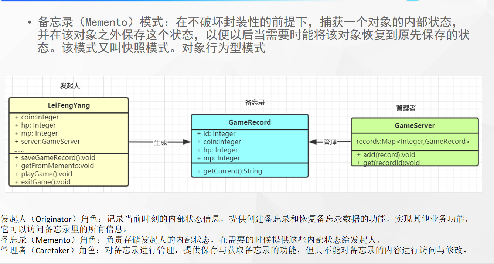

# 什么是备忘录模式



## 代码

```java
public class GameRecord {

    Integer id;
    Integer coin;
    Integer hp;
    Integer mp;


    void getCurrent(){
        System.out.println(coin + "\t" + hp + "\t" + mp);
    }
}
```

```java
public class GameServer {

    Map<Integer, GameRecord> map = new HashMap<>();

    void add(GameRecord record) {
        map.put(record.id,record);
    }

    LeiGame getRecode(Integer id) throws InvocationTargetException, IllegalAccessException {
        GameRecord gameRecord = map.get(id);
        LeiGame leiGame = new LeiGame();
        // 获取到备忘录内的内容
        BeanUtils.copyProperties(leiGame, gameRecord);
        return leiGame;
    }
}
```

```java
@Data
@AllArgsConstructor
@NoArgsConstructor
public class LeiGame {
    // 剩余金币
    Integer coin;
    // 血量
    Integer hp;
    //  蓝量
    Integer mp;


    void saveGameRecord() {
        GameServer gameServer = new GameServer();

        System.out.println("正在保存当前记录。。。");
    }

    void getFromMemento() {
        System.out.println("获取历史存档信息。。。。");
    }

    void playGame() {
        System.out.println("------()-------");
        int i = new Random().nextInt();
        coin = i;
        hp = i;
        mp = i;
    }

    void exitGame() {
        System.out.println("退出");
        saveGameRecord();
    }


}
```

# 使用场景

- 游戏存档
- 数据库保存点事务`（savepoint）`
- session活化钝化