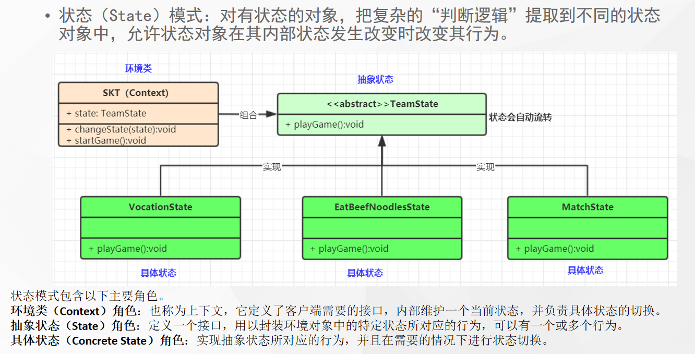

# 什么是状态模式



## 代码

```java
public class BeafNodleState implements TeamState{
    @Override
    public void playGame() {
        System.out.println("牛肉面....");
    }

    @Override
    public TeamState nexxt() {

    return new MatchState();
    }
}
```

```java
public class MatchState implements TeamState{
    @Override
    public void playGame() {
        System.out.println("数学比赛...");
    }

    @Override
    public TeamState nexxt() {
        return new VocationState();
    }
}
```

```java
public class SKTTeam {

    private TeamState state;

    public void setState(TeamState state) {
        this.state = state;
    }

    public void startGame() {
        // 状态改变结果
        state.playGame();
    }

    void nextState() {
        state = state.nexxt();
    }

}
```

# 使用场景

- 策略模式和状态模式是一样的？
- 状态模式核心需要具体状态类能在必要的时候切换状态
- 流程框架与状态机