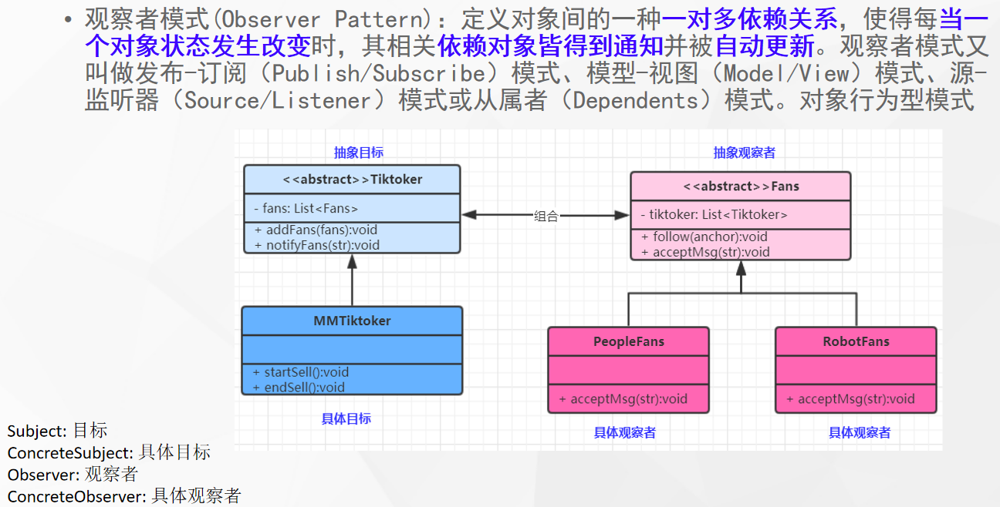

# 什么是观察者模式



## 代码

```java
public abstract class AbstractFans {


    void following(AbstractTikToker tikToker) {
        tikToker.addFans(this);
    }

    abstract void acceptMessage(String msg);
}
```

```java
public abstract class AbstractTikToker {

    abstract void addFans(AbstractFans abstractFans);

    abstract void notifyFans(String msg);
}
```

```java
public class HuManFans extends AbstractFans {
    @Override
    void acceptMessage(String msg) {
        System.out.println(msg);
    }
}
```

```java
public class MMTikToker extends AbstractTikToker {

    List<AbstractFans> abstractFansList = new ArrayList<>();

    void startSell() {
        System.out.println("lfy......");
        notifyFans("开始卖东西....");
    }

    void stopSell() {
        System.out.println("结束直播......");
        notifyFans("结束卖东西....");
    }

    @Override
    void addFans(AbstractFans abstractFans) {
        abstractFansList.add(abstractFans);
    }

    @Override
    void notifyFans(String msg) {
        for (AbstractFans abstractFans : abstractFansList) {
            abstractFans.acceptMessage(msg);
        }
    }
}
```

```java
public class RobotFans extends AbstractFans {
    @Override
    void acceptMessage(String msg) {
        System.out.println(msg);
    }
}
```

# 使用场景

- Spring事件机制如何实现？

- `Vue`的双向绑定核心
- 响应式编程核心思想