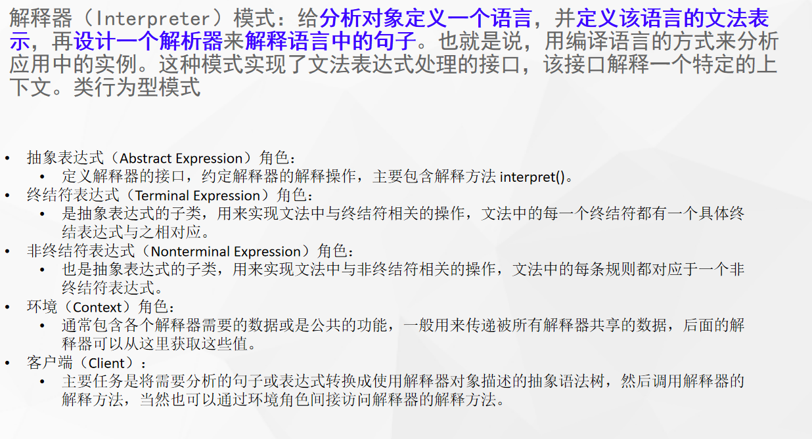

# 什么是解释器模式



## 代码

```java
public class Area {
    Set<String> city = new HashSet<>();
    Set<String> type = new HashSet<>();


    IDCardExpression idCardExpression;

    public Area() {
        city.add("武汉市");
        city.add("上海市");
        type.add("医生");
        type.add("老人");
        type.add("儿童");
        TerminaExpression city = new TerminaExpression(this.city, ":");
        TerminaExpression type = new TerminaExpression(this.type, "-");


        idCardExpression = new OrExpression(city, type);
    }

    void getTick(String city){
        boolean interpret = idCardExpression.interpret(city);
        if(interpret){
            System.out.println("免费");
        }else {
            System.out.println("付费");
        }
    }
}
```

```java
public abstract class IDCardExpression {
    /**
     * 定义解析逻辑
     */
    abstract boolean interpret(String str);
}
```

```java
public class OrExpression extends IDCardExpression {

    private IDCardExpression cityExpression;
    private IDCardExpression typeExpression;

    public OrExpression(TerminaExpression city, TerminaExpression type) {
        this.cityExpression = city;
        this.typeExpression = type;
    }

    @Override
    boolean interpret(String str) {
        return cityExpression.interpret(str) || typeExpression.interpret(str);
    }

    public void OrExpression(IDCardExpression cityExpression, IDCardExpression typeExpression) {
        this.cityExpression = cityExpression;
        this.typeExpression = typeExpression;
    }
}
```

```java
public class TerminaExpression extends IDCardExpression{

    Set<String> data;
    String symbol;

    public TerminaExpression( Set<String> data,  String symbol) {
        this.data = data;
        this.symbol = symbol;
    }

    @Override
    boolean interpret(String str) {
        String[] split = str.split(symbol);
        //
        boolean result = false;
        for (String s : split) {
            if(data.contains(s)){
                return true;
            }
        }
        return false;
    }
}
```

# 使用场景

- Spring的表达式解析：#{}
- `Thymeleaf`等模板引擎的语法解析
- 编译原理

