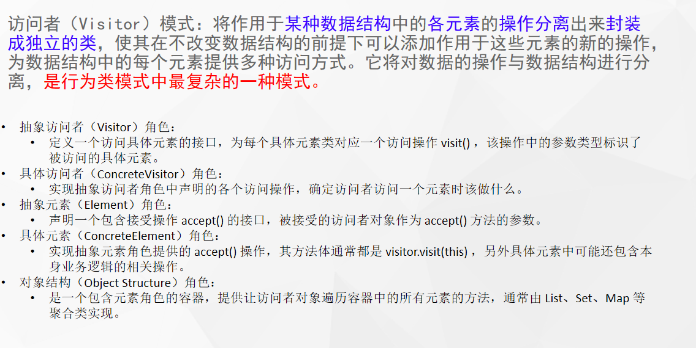

# 什么是访问者模式



## 代码

```java
public class UpDatePackage implements Vistor {

    private String ext;


    public  UpDatePackage(String ext) {
        this.ext = ext;

    }

    @Override
    public void visitCpu(Cpu cpu) {
        cpu.command = "正在升级";
        System.out.println( cpu.command);
    }

    @Override
    public void visitDisk(Disk disk) {
        disk.command = "正在升级";
        System.out.println(disk.command);
    }
}
```

```java
public class Cpu extends HardWare{

    public Cpu(String command) {
        super(command);
    }

    @Override
    void work() {
        System.out.println("cpu");
    }

    @Override
    public void accept(Vistor visitor) {
        visitor.visitCpu(this);
    }


}
```

```java

public class Disk extends HardWare {
    public Disk(String command){
        super(command);
    }

    @Override
    void work() {
        System.out.println("disk 指令历史");
    }

    @Override
    public void accept(Vistor visitor) {
        visitor.visitDisk(this);
    }


}

```

```java
public abstract class HardWare {
    String command;


    public HardWare(String command){
        this.command = command;
    }
    abstract  void work();
    public abstract  void accept(Vistor visitor);

}
```

```java
public interface Vistor {
    void visitCpu(Cpu cpu);

    void visitDisk(Disk disk);
}
```

```java
public class XiaoAi {

    private Cpu cpu  = new Cpu("天气");
    private Disk disk = new Disk("天气");


    void answerQuestion(){
        cpu.work();
        disk.work();
    }

    public void acceptPackage(UpDatePackage upDatePackage) {
        upDatePackage.visitCpu(cpu);
        upDatePackage.visitDisk(disk);
    }
}
```

# 使用场景

- 在访问者模式中，每增加一个新的元素类，都要在每一个具体访问者类中增加相应的具体操作，这违背了“开闭原则”。
- 违反依赖倒置原则。访问者模式依赖了具体类，而没有依赖抽象类破坏封装。
- 访问者模式中具体元素对访问者公布细节，这破坏了对象的封装性
- 应用于对象结构相对稳定，但其操作算法经常变化的程序。
- Spring反射工具中的`MethodVisitor`是什么？