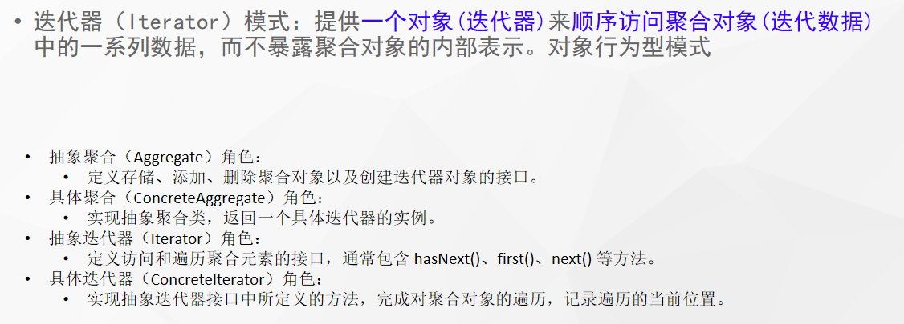

# 什么是迭代器（Iterator）模式



## 代码

```java
public abstract class BeautifulMan {

    private List<String> girls = new ArrayList<>();

    void likeyou(String name) {
        girls.add(name);
    }

    void saybe(String name) {
        girls.remove(name);
    }

    public Itr getItr() {
        return new Iterator();
    }

    class Iterator implements Itr {
        private int curosr = 0;

        @Override
        public boolean hasNext() {
            int size = girls.size();
            return curosr < size;
        }

        @Override
        public String next() {
            String s = girls.get(curosr);
            curosr++;
            return s;
        }

        @Override
        public String firstLove() {
            return girls.get(0);
        }

        @Override
        public String current() {
            return girls.get(girls.size() - 1);
        }
    }

    interface Itr {
        boolean hasNext();

        String next();

        String firstLove();

        String current();
    }
}
```

# 使用场景

- jdk容器接口的Iterator定义
- 现实开发中，我们几乎无需编写迭代器，基本数据结构链表、树、图的迭代器已经都有了。除非要重写迭代逻辑